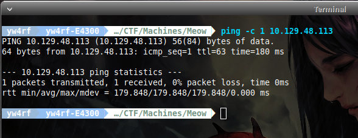
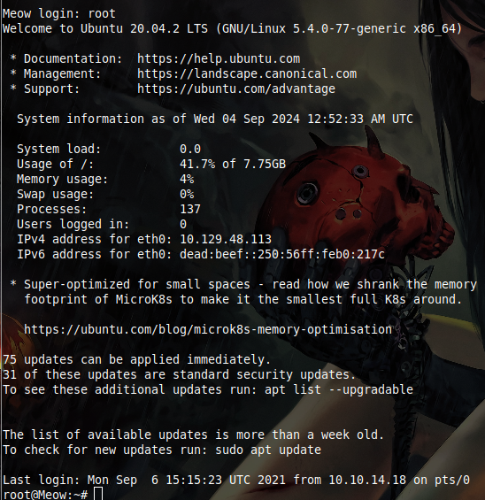

## Introduction

En esta resolución de la máquina Meow de la plataforma HackTheBox se explota una vulnerabilidad en Telnet aprovechado credenciales débiles y obtenido acceso como root.

~~~
Platform: HackTheBox
Level: Very Easy
OS: Linux
~~~

## Enumeration

~~~
Target: 10.129.48.113
~~~

Iniciamos utilizando el comando ping, que emplea el protocolo ICMP (Protocolo de Control de Mensajes de Internet). Este comando envía un mensaje de solicitud de eco a la IP especificada y espera una respuesta de eco, lo cual nos permite comprobar si la máquina está activa y medir la latencia.

El hecho de recibir una respuesta indica que la máquina está en línea.

## Scanning 

Procedemos a realizar un escaneo con Nmap para identificar los puertos abiertos y los servicios que corren en ellos. Usamos una configuración agresiva para obtener resultados detallados rápidamente.

~~~Shell
sudo nmap -p- --open -sV --min-rate 5000 -n -Pn -vvv 10.129.48.113 -oG meow-scan
~~~

Se ha detectado que el puerto 23/tcp está abierto, y se identifica el servicio como Telnet.

~~~
Telnet es un protocolo que permite acceder remotamente a otras máquinas como si estuviéramos trabajando directamente en ellas. Opera por defecto sobre el puerto 23 y utiliza TCP. Sin embargo, tiene una gran desventaja: no cifra las comunicaciones, incluyendo nombres de usuario y contraseñas, lo que lo hace vulnerable a ataques de tipo Man-in-the-Middle.
~~~

## Exploitation

Usamos el comando telnet junto con la dirección IP para intentar conectarnos a la máquina:

Tras probar varios nombres de usuario comunes como admin o administrator, logramos iniciar sesión sin contraseña usando el usuario root:

Al ingresar como root, obtenemos acceso total al sistema.

Listamos los archivos con **ls**, observamos el archivo flag.txt. Para visualizar su contenido y completar la máquina, ejecutamos **cat flag.txt**:

ROOTED
