## Introduction

En este Sherlock, la tarea consistió en investigar al grupo Sandworm Team (también conocido como APT44 o BlackEnergy Group), una amenaza avanzada persistente conocida por sus ataques a infraestructuras críticas. Utilizando el marco MITRE ATT&CK, se analizaron las tácticas, técnicas y procedimientos (TTPs) asociados a este grupo, respondiendo preguntas clave sobre sus campañas más relevantes, las herramientas utilizadas y sus métodos de ataque. Esta experiencia permitió fortalecer habilidades en ciberinteligencia, análisis forense y defensa contra amenazas dirigidas a entornos industriales.

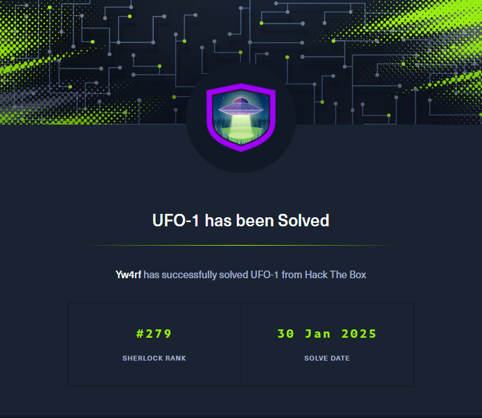

~~~
Platform: HackTheBox
Level: VeryEasy
Type: Research, Threat Intelligence
~~~

### Sherlock  Scenario

> Al estar en la industria de **Sistemas de Control Industrial (ICS)**, tu equipo de seguridad siempre debe estar actualizado y al tanto de las amenazas dirigidas a las organizaciones de tu sector. Acabas de comenzar como pasante de **inteligencia de amenazas**, con algo de experiencia en **SOC**. Tu gerente te ha asignado una tarea para poner a prueba tus habilidades de investigación y evaluar qué tan bien puedes aprovechar **MITRE ATT&CK** a tu favor. Investiga sobre el **equipo Sandworm**, también conocido como **BlackEnergy Group** y **APT44**. Utiliza **MITRE ATT&CK** para comprender cómo mapear el comportamiento y las tácticas del adversario de manera procesable. Domine la evaluación e impresione a su gerente ya que la inteligencia de amenazas es su pasión.

### Key Information

- El **Sandworm Team** es un grupo de amenazas destructivas que ha sido atribuido a la Dirección Principal de Inteligencia del Estado Mayor General de Rusia (GRU), específicamente al Centro Principal de Tecnologías Especiales (GTsST) de la unidad militar 74455. Este grupo ha estado activo desde al menos 2009. [Source](https://attack.mitre.org/groups/G0034/)

### Task 1: 

> According to the sources cited by Mitre, in what year did the Sandworm Team begin operations?

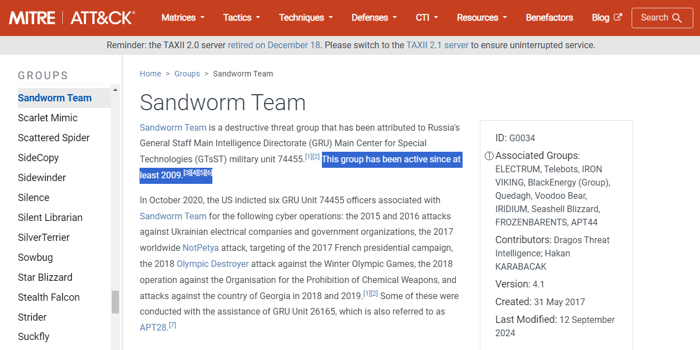

### Task 2:

> Mitre notes two credential access techniques used by the BlackEnergy group to access several hosts in the compromised network during a 2016 campaign against the Ukrainian electric power grid. One is LSASS Memory access (T1003.001). What is the Attack ID for the other?

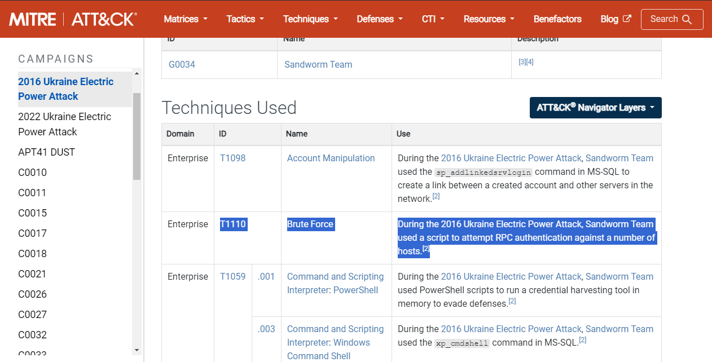

### Task 3:

> During the 2016 campaign, the adversary was observed using a VBS script during their operations. What is the name of the VBS file?

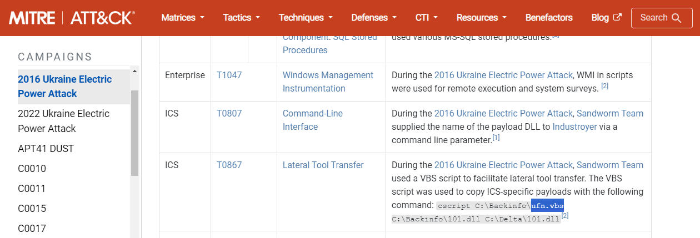

### Task 4:

> The APT conducted a major campaign in 2022. The server application was abused to maintain persistence. What is the Mitre Att&ck ID for the persistence technique was used by the group to allow them remote access?

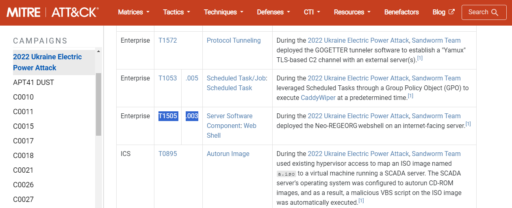

### Task 5:

> What is the name of the malware / tool used in question 4?

### Task 6:

> Which SCADA application binary was abused by the group to achieve code execution on SCADA Systems in the same campaign in 2022?

### Task 7:

> Identify the full command line associated with the execution of the tool from question 6 to perform actions against substations in the SCADA environment.

### Task 8:

> What malware/tool was used to carry out data destruction in a compromised environment during the same campaign?

### Task 9:

> The malware/tool identified in question 8 also had additional capabilities. What is the Mitre Att&ck ID of the specific technique it could perform in Execution tactic?

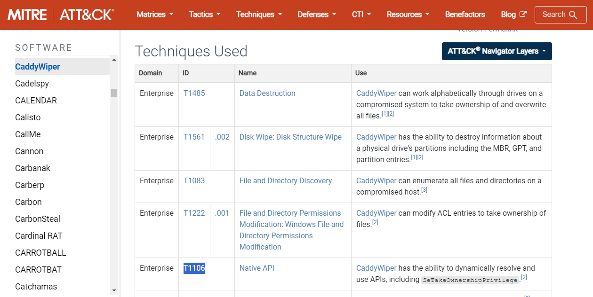

### Task 9:

> The Sandworm Team is known to use different tools in their campaigns. They are associated with an auto-spreading malware that acted as a ransomware while having worm-like features .What is the name of this malware?

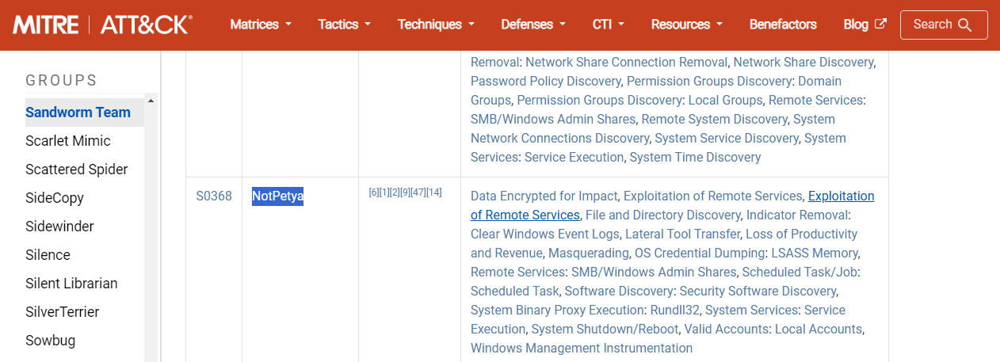

### Task 11:

> What was the Microsoft security bulletin ID for the vulnerability that the malware from question 10 used to spread around the world?

### Task 12:

> What is the name of the malware/tool used by the group to target modems?

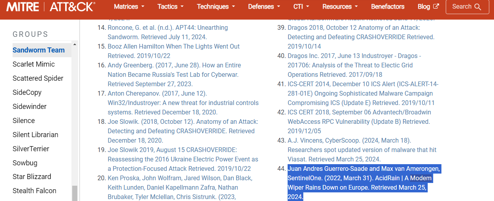

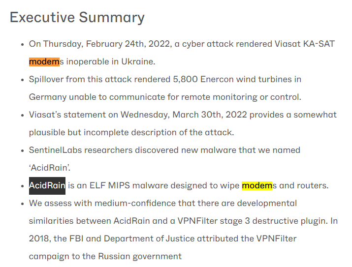

### Task 13:

> Threat Actors also use non-standard ports across their infrastructure for Operational-Security purposes. On which port did the Sandworm team reportedly establish their SSH server for listening?

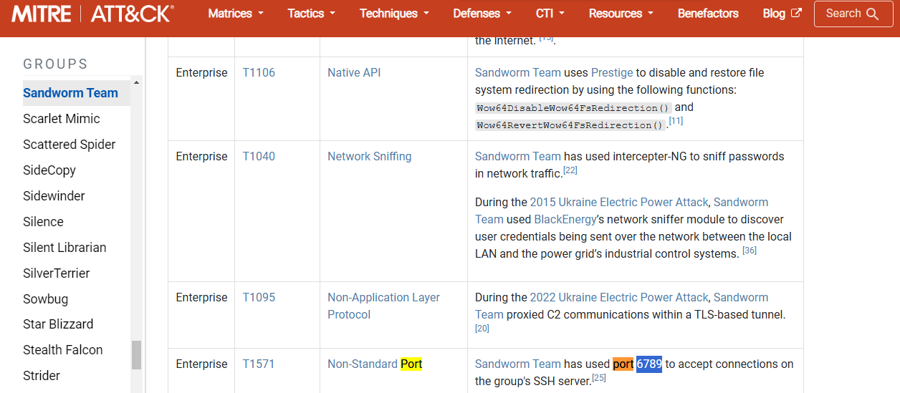

### Task 14: 

> The Sandworm Team has been assisted by another APT group on various operations. Which specific group is known to have collaborated with them?

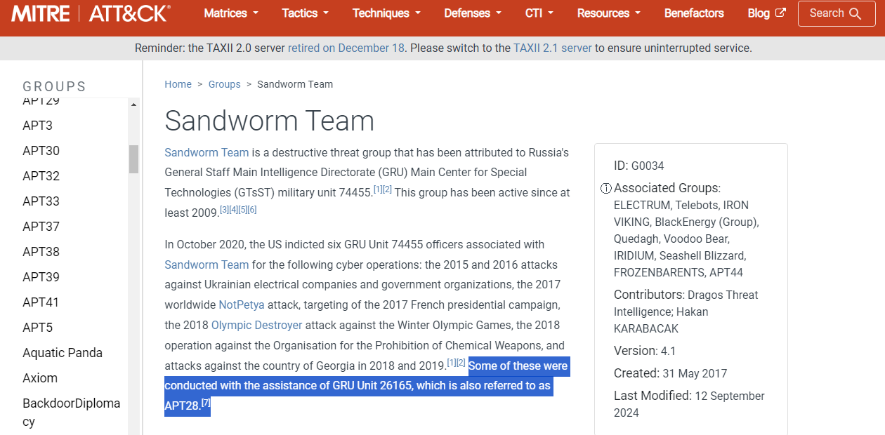

[Verify Achievment](https://labs.hackthebox.com/achievement/sherlock/2035837/840)

